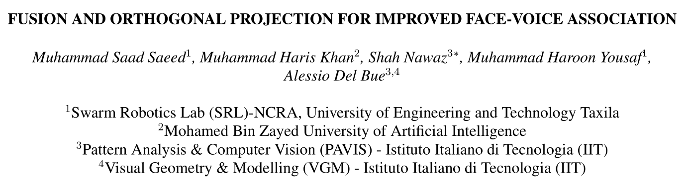
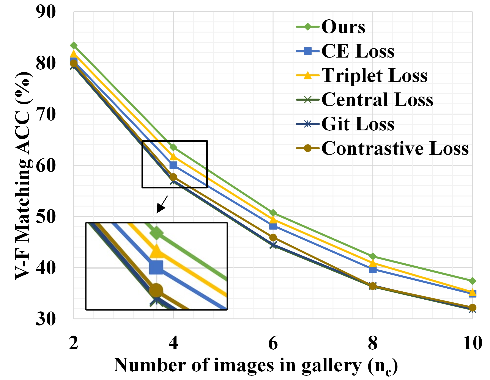
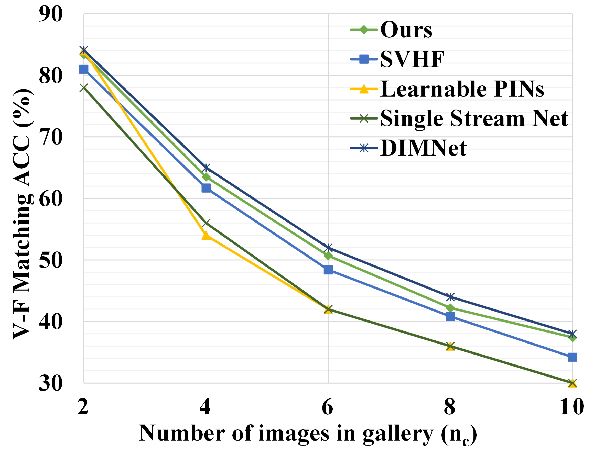

# FOP (ICASSP 2022)
Official implementation of FOP method as described in "Fusion and Orthogonal Projection for Improved Face-Voice Association". 
<p align="center">
  <l align="center">Paper: https://arxiv.org/abs/2112.10483</l>   
</p>


<p align="center">
  <l align="center">Presentation: https://youtu.be/mnV7FSsKIuM</l>   
</p>

<p align="center">
  
</p>

## Proposed Methodology
(Left) Overall method. Fundamentally, it is a two-stream pipeline which generates face and voice embeddings. We
propose fusion and orthogonal projection (FOP) mechanism (dotted red box). (Right) The architecture of multimodal fusion.
<p align="center"> 
  
  
 </p>

  
## Installation
We have used python==3.6.5 and torch==1.8.0 for these experiments. It may not run on other versions of Python/Torch.
To install dependencies run:
```
pip install -r requirements.txt
```
For installation of Pytorch and CUDA (For GPU):
```
conda install pytorch==1.8.0 torchvision==0.9.0 torchaudio==0.8.0 cudatoolkit=10.2 -c pytorch
```
## Feature Extraction
We have used VoxCeleb1 for the experimentation in this work. The dataset and train/test splits can be downloaded [here](https://www.robots.ox.ac.uk/~vgg/data/voxceleb/vox1.html)
### Facial Feature Extraction
For Face Embeddings we use [VGGFace](http://www.bmva.org/bmvc/2015/papers/paper041/index.html). We use the Keras implementation of this paper from this [repository](https://gist.github.com/EncodeTS/6bbe8cb8bebad7a672f0d872561782d9)
### Voice Feature Extraction
For Voice Embeddings we use the method described in [Utterance Level Aggregator](https://arxiv.org/abs/1902.10107). The code we used is released by authors and is publicly available [here](https://github.com/WeidiXie/VGG-Speaker-Recognition)

Once the features are extracted, write them to a .csv file in features directory. The csv files of train and test splits (random_unseen_unheard) can be downloaded [here](https://drive.google.com/drive/folders/1vplsrEIlufVG2n86C7uBdtfRVW6P-o-Z?usp=sharing)
## Training and Testing
### Training
- Linear Fusion:
```
python main.py --cuda 1 --save_dir ./model --lr 1e-5 --batch_size 128 --max_num_epoch 50 --alpha_list [0.0, 0.1, 0.5, 1.0, 2.0, 5.0] --dim_embed 128 --fusion linear --test_epoch 5
```
- Gated Fusion:
```
python main.py --cuda 1 --save_dir ./model --lr 1e-5 --batch_size 128 --max_num_epoch 50 --alpha_list [0.0, 0.1, 0.5, 1.0, 2.0, 5.0] --dim_embed 128 --fusion gated --test_epoch 5
```
### Testing
- Linear Fusion:
```
python test.py --cuda 1 --ckpt <path to checkpoint.pth.tar> --dim_embed 128 --fusion linear --alpha 1
```
- Gated Fusion:
```
python test.py --cuda 1 --ckpt <path to checkpoint.pth.tar> --dim_embed 128 --fusion gated --alpha 1
```
## Comparison
Cross-modal matching results: (Left) FOP vs other losses used in V-F methods. (Right) Our method vs SOTA methods.
<p align="center"> 
  
  
 </p>

## Citing FOP
```BibTeX
@inproceedings{saeed2022fusion,
  title={Fusion and Orthogonal Projection for Improved Face-Voice Association},
  author={Saeed, Muhammad Saad and Khan, Muhammad Haris and Nawaz, Shah and Yousaf, Muhammad Haroon and Del Bue, Alessio},
  booktitle={ICASSP 2022-2022 IEEE International Conference on Acoustics, Speech and Signal Processing (ICASSP)},
  pages={7057--7061},
  year={2022},
  organization={IEEE}
}
```
