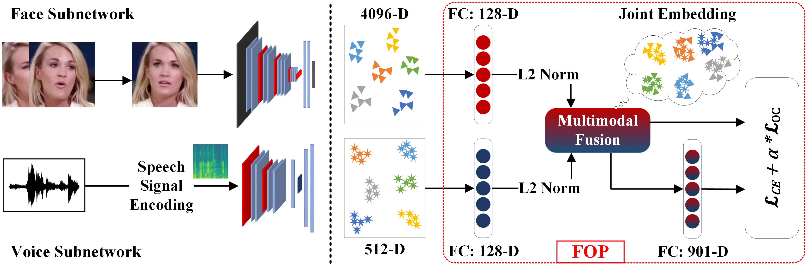
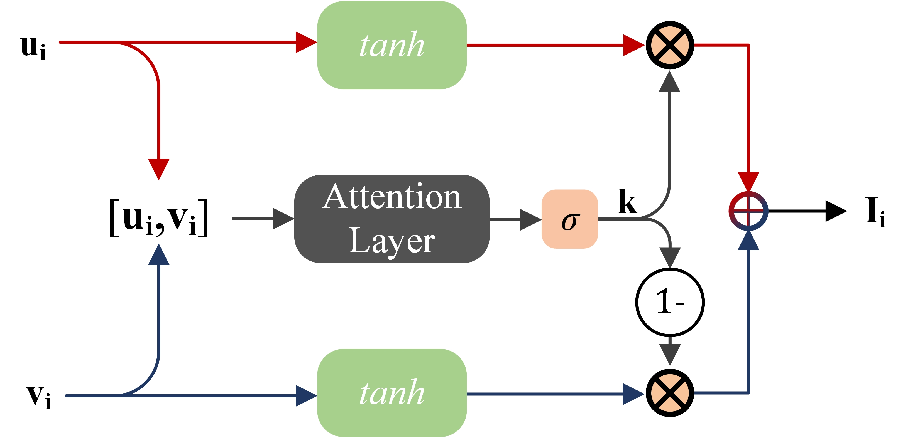

# FOP (ICASSP 2022)
Official implementation of FOP method as described in "Fusion and Orthogonal Projection for Improved Face-Voice Association"

## Proposed Methodology
(Left) Overall method. Fundamentally, it is a two-stream pipeline which generates face and voice embeddings. We
propose fusion and orthogonal projection (FOP) mechanism (dotted red box). (Right) The architecture of multimodal fusion.

## Requirements

## Comparison

## Citing FOP
@article{sasnet,
  title={FUSION AND ORTHOGONAL PROJECTION FOR IMPROVED FACE-VOICE ASSOCIATION},
  author={Muhammad Saad Saeed and Muhammad Haris Khan and Shah Nawaz and Muhammad Haroon Yousaf and Alessio Del Bue},
  journal={Internation Conference on Acoustics, Speech, and Signal Processing (ICASSP-22)},
  year={2022}
}
